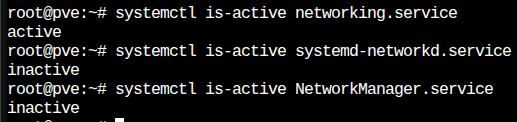

# Linux/Proxmox network config templates

>Набор шаблонных файлов конфигурации с различными настройками сети 

## Инструменты конфигурации сети:

- ifupdown2 - инструмент конфигурации сети по умолчанию в актуальных дистрибутивах Debian. Также используется в Proxmox. Файл конфигурации по умолчанию /etc/network/interfaces. 
- netplan - инструмент конфигурации сети по умолчанию в Ubuntu, начиная с версии 18.04. Файлы конфигурации располагаются в /etc/netplan/.

### Как понять, какой инструмент используется в вашей системе:
По умолчанию ifubdown2 и netpan используются разными службами.
1) Вводите команду `systemctl is-active networking.service`. Если данная служба активна, используется ifupdown2.
2) Вводите команду `systemctl is-active systemd-networkd.service`. Если данная служба активна, используется netplan
3) Вводите команду `systemctl is-active NetworkManager.service`. Если данная служба активна, используется netplan (обычно активно в десктопных версиях Ubuntu).



Файлы конфигурации netplan в данном репозитории настроены на использование службы systemd-networkd, а не NetworkManager. Для корректной работы необходимо убедиться, что данная служба активна. Если нет, то требуется активировать `systemctl enable systemd-networkd.service` и запустить `systemctl start systemd-networkd.service` ее.

## Структура репозитория:

```  
├── ifupdown2/  # Директория c файлами конфигурации ifupdown2
│
│            ├── interfaces-dhcp            # Получение IP по DHCP
│
│            ├── interfaces-double-ip       # Настройка интерфейса с 2 IP
│
│            ├── interfaces-routes          # Пример сохранения маршрутов с помощью post-up и pre-down
│
│            ├── interfaces-static          # Конфигурация статического IP
│  
├── netplan/  # Директория c файлами конфигурации netplan
│
│            ├── 99-netplan-dhcp.yaml       # Получение IP по DHCP
│
│            ├── 99-netplan-static.yaml     # Конфигурация статического IP
│
├── proxmox/  # Директория c файлами конфигурации ifupdown2 для Proxmox
│
│            ├── interfaces-bridge-dhcp     # Конфигурация одного vmbr с получением IP по DHCP
│
│            ├── interfaces-bridge-static   # Конфигурация одного vmbr со статическим IP
│
│            ├── interfaces-nat             # Конфигурация двух vmbr для организации NAT 

```

Чтобы применить конфигурацию необходимо:
- Для ifupdown2/Proxmox нужный файл конфигурации поместить в /etc/network/interfaces.d или заменить им файл /etc/network/interfaces (не рекомендуется). Далее необходимо перезагрузить сетевую службу `systemctl reload-or-restart networking.service`.
- Для netplan нужный файл конфигурации поместить в /etc/netplan/ и задать ему наибольший порядковый номер (определяет приоритет) среди всех файлов конфигурации в данной директории. Далее необходимо перезагрузить сетевую службу `systemctl reload-or-restart systemd-networkd.service` или `systemctl reload-or-restart NetworkManager.service`
